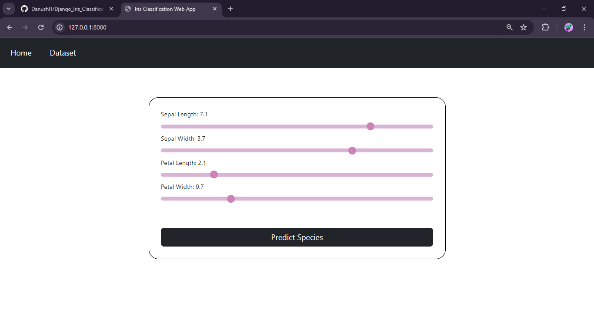
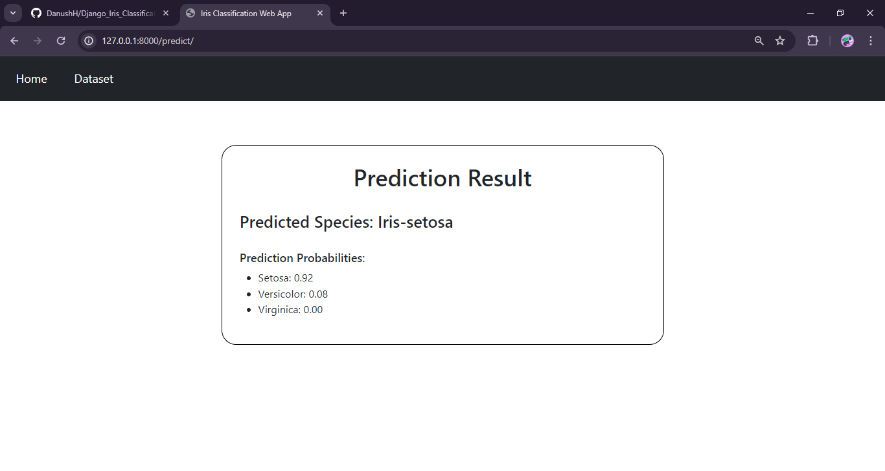
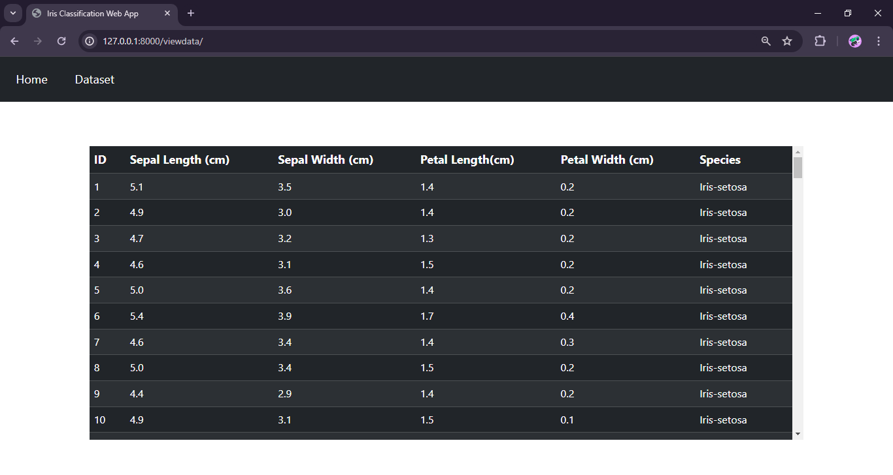

<h1 align="center">Django Iris Species Classification Web App</h1>

## Overview
- A web application developed with [Django](https://www.djangoproject.com/), a high-level web framework for Python.
- This application provides functionality for predicting category of an Iris flower when given features as user input.
- Application is built by training a [RandomForestClassifier](https://scikit-learn.org/stable/modules/generated/sklearn.ensemble.RandomForestClassifier.html) for Iris dataset using [scikit-learn](https://scikit-learn.org/) library.
- Application uses a [CSV Iris dataset](https://github.com/DanushH/Django_Iris_Classification_Web_App/blob/main/irisproject/irisapp/dataset/Iris.csv) and stores it in a sqlite database and extracts data from the database to train the model.

 

## Tech Stack
[![Python][Python-badge]][Python-url]
[![Django][Django-badge]][Django-url]
[![Bootstrap][Bootstrap-badge]][Bootstrap-url]
[![ScikitLearn][Scikit-badge]][Scikit-url]

 

## Features

- Home Page

  

- Prediction Page
  

  

- Dataset Page
  

  

 

## Contact

[![LinkedIn][linkedin-shield]][linkedin-url]

 

<!-- MARKDOWN LINKS & IMAGES -->
[Python-badge]: https://img.shields.io/badge/Python-black?style=for-the-badge&logo=python&logoColor=%23FDD835
[Python-url]: https://www.python.org
[Django-badge]: https://img.shields.io/badge/Django-black?style=for-the-badge&logo=django&logoColor=%231B5E20
[Django-url]: https://www.djangoproject.com
[Bootstrap-badge]: https://img.shields.io/badge/Bootstrap-black?style=for-the-badge&logo=bootstrap&logoColor=%236A1B9A
[Bootstrap-url]: https://getbootstrap.com/
[Scikit-badge]: https://img.shields.io/badge/Scikit--Learn-black?style=for-the-badge&logo=scikitlearn&logoColor=%23F7931E
[Scikit-url]: https://scikit-learn.org/
[linkedin-shield]: https://img.shields.io/badge/Linkedin-black?style=for-the-badge&logo=linkedin&logoColor=%230277BD
[linkedin-url]: https://linkedin.com/in/danushika-herath

 
